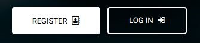
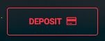
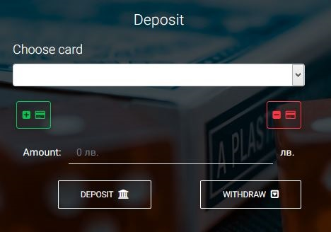
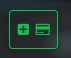
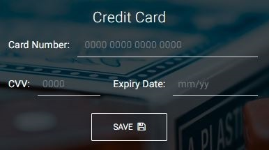

# Final teamwork project for Telerik Academy Alpha .NET Jul' 18
## Assignment from Bede Gaming

## ItsAllAboutTheGame Team Members
- Едуард Ваклинов - https://my.telerikacademy.com/Users/Edwardcho
- Александър Борисов - https://my.telerikacademy.com/Users/WolfIsMyName

## Presents

## About
ItsAllAboutTheGame is a casino system with some features like slot-games, Admin menu and CRUD operations.

Used technology: ASP.NET Core 2.1

## Main
The index page is the root of our application, it leads to the Game Page. Only registered users can play. The registration is achieved through Register Button in the top right panel:  

The User is Redirected to Register Page:  

Every field in this register form has **Client-Side** validation achieved through jQuery and Remote attributes. The .js file is located in **~/js/register.js**. The Remote attribute is located in **AccountController/IsBirthDateValid**.
Every field also has **Server-Side** validation achieved through proper validation of the **RegisterViewModel**.

After successful registration the user is automatically logged-in. If he logs out he will need to use the Login Button in the top right panel:  

The User is Redirected to Login Page:  

Every field in this login form has **Client-Side** and **Server-Side** validation achieved through proper validation of the **LoginViewModel**

After successful login the user has to deposit money so he can play. He need to use the Deposit button:
 

 The User is Redirected to Desposit Page:  

If the user wants to Deposit or Withdraw money he needs to add a card, which is achieved through Add Card Button:  

The User is Redirected to Add Card Page:  

Every field in this Add Card form has **Client-Side** validation achieved through jQuery and Remote attributes. The .js file is located in **~/js/creditcard.js**. The DoesExist Remote attribute is located in **TransactionController/DoesExist** and the IsDateValid  attribute is located in **TransactionController/IsDateValid**.
Every field also has **Server-Side** validation achieved through proper validation of the **AddCardViewModel**.
After successfully saving the card the card will appear in the Choose Card drop-down. The server will constantly monitor for expired cards and they will appear as disabled fields. 

