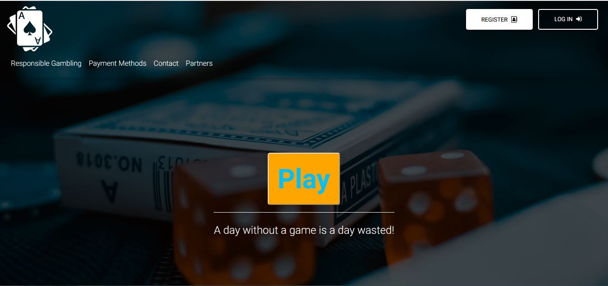

# Final teamwork project for Telerik Academy Alpha .NET Jul' 18
## Assignment from Bede Gaming

## ItsAllAboutTheGame Team Members
- Edward Vaklinov - https://my.telerikacademy.com/Users/Edwardcho
- Aleksandar Borisov - https://my.telerikacademy.com/Users/WolfIsMyName

## Presents

## About
ItsAllAboutTheGame is a casino system with some features like slot-games, Admin menu and CRUD operations.

Used technology: ASP.NET Core 2.1

## Main
The index page is the root of our application, it leads to the Game Page. Only registered users can play. The registration is achieved through **Register Button** in the top right panel:  

The user is redirected to **Register Page**:  

Every field in this register form has **Client-Side** validation achieved through jQuery and Remote attribute. The .js file is located in **~/js/register.js**. The Remote attribute is located in **AccountController/IsBirthDateValid**.
Every field also has **Server-Side** validation achieved through proper validation of the **RegisterViewModel**.

After successful registration the user is automatically logged-in. If he logs out he will need to use the **Login Button** in the top right panel:  

The user is redirected to **Login Page**:  

Every field in this login form has **Client-Side** and **Server-Side** validation achieved through proper validation of the **LoginViewModel**

After successful login the user has to deposit money so he can play. He need to use the **Deposit Button**:
 

 The user is redirected to **Desposit Page**:  

If the user wants to **Deposit** or **Withdraw** money he needs to add a card, which is achieved through **Add Card Button**:  

The user is redirected to **Add Card Page**:  

Every field in this **Add Card Form** has **Client-Side** validation achieved through jQuery and Remote attributes. The .js file is located in **~/js/creditcard.js**. The DoesExist Remote attribute is located in **TransactionController/DoesExist** and the IsDateValid  attribute is located in **TransactionController/IsDateValid**.
Every field also has **Server-Side** validation achieved through proper validation of the **AddCardViewModel**.
After successfully saving the card, it will appear in the **hoose Card Drop-down**. The server will constantly monitor for expired cards and they will appear as disabled fields:  

The user can delete any of his cards through **Delete Card Button**:  

Which redirects him to **Delete Card Form**:

Where he can delete any of his cards.

The user can monitor his transactions when he clicks on his name:

Which displays the table with all of his transactions:  

When the user has positive balance he can play one of the three available games:  

Every chosen game will lead him to game with size of the grid that he chose, e.g. **4x3 Grid**:  

He can stake and win on the selected game.
Every field in this **Game Form** has **Client-Side** validation achieved through jQuery and Remote attributes. The .js file is located in **~/js/gameone.js**. Every field also has **Server-Side** validation achieved through proper validation of the **WalletViewModel**. All game logic can be found in the **Services.Game** assembly

The site also supports **Admin Roles**. They have access to two additional tables from the **Admin Panel**:

All of the admin logic is controller from the **Controllers in Administration Area**.

The first admin table is the **Users Table**:  

There admins can lockout users, delete users and assign admin roles to users. All actions in this table are managed by **Users Controller** in the coresponding area.

The second admin table is the **Transactions Table**:  

There admins can see all transactions, or filter them by a selected user. All actions in this table are managed by **Transactions Controller** in the coresponding area.

